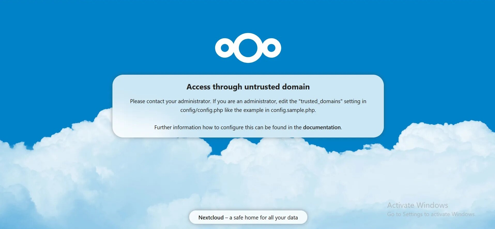
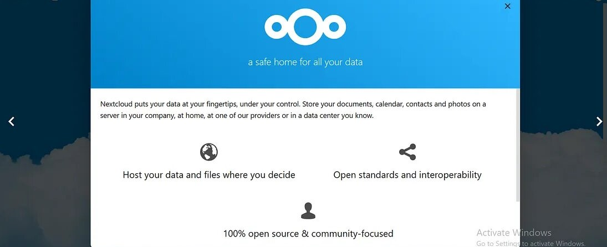
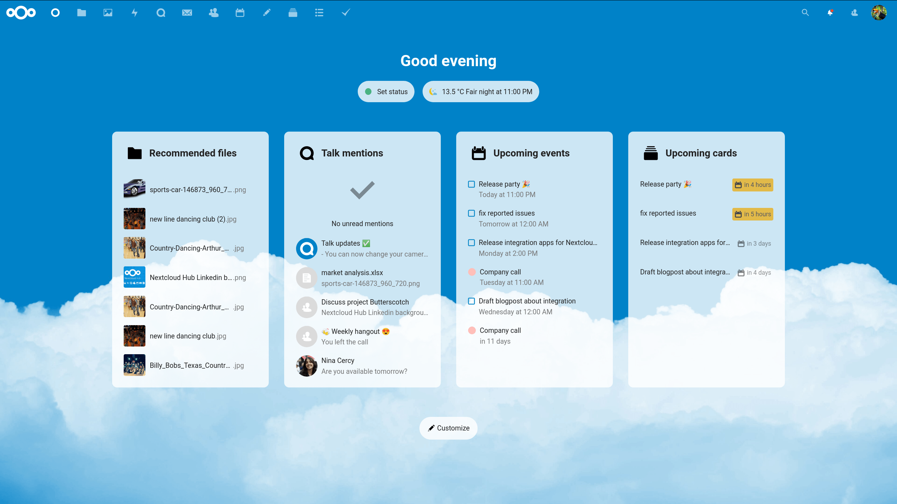

# Azure - How to Create a Virtual Machine and Deploy a Web Server 

This project will be a step by step video walkthrough. It's the first of many Azure projects and guides I'm planning to write, explore  and share with you. All of the other projects can be found in this GitHub repository. Through my work with Azure's services, I plan to document my learnings and share them with others who are also interested in mastering Azure.

# Project Introduction

In this Guided Project, we will create a [Virtual Machine](#what-is-a-virtual-machine) in Azure to deploy a web server, specifically a [Nextcloud server](#what-is-nextcloud). Instead of using just the presets, we will explore how the basic architecture of Azure works, by creating a Virtual Machine, connecting it to a subnet, protected by inbound and outbound rules thanks to [Network Security Groups](#what-is-a-network-security-group), in a [Virtual Network](#what-is-a-virtual-network). We'll use [Bastion](#what-is-bastion) to connect to the machine via SSH, without exposing an external port to the Internet, and then installing a simple Nextcloud server and make the Virtual Machine available by opening a public IP and a DNS label.

# Prerequisites

### Microsoft Azure Account

Microsoft Azure offers a free account option that allows users to explore and use some of the Azure services for free. This account is ideal for those who want to test Azure services and features before committing to a paid plan. The free account comes with a $200 credit that you can use to try out Azure services for 30 days. Once the credit is exhausted, you can continue using the free services with some limitations. Here is a [signup guide](https://medium.com/@mashiyathussain2/how-to-create-microsoft-azure-account-2a9f37025374) if you need one. 

# **Step 1: Creating a Resource Group**

### What is a Resource Group?

In Azure, a [resource group](https://learn.microsoft.com/en-us/azure/azure-resource-manager/management/manage-resource-groups-portal) is a container that holds related Azure resources, such as virtual machines, databases, and web apps. It helps you organize and manage these resources together, making it easier to handle tasks like deployment, access control, and cost tracking. Think of it as a folder that keeps everything for a specific project or purpose neatly organized.

### Creating a Resource Group

Now that we know what a resource group is let's begin by creating one that will allow us to group all of our resources into a Logical group. I named it RG-VMP (Resource Group - Virtual Machine Project) but you can name it however you want. 

* **Choose your own region**. in short , selecting the appropriate region when creating a resource group in Azure is essential for optimizing performance, ensuring compliance, managing costs, and enhancing resilience and availability for your applications and services.

##### Follow the video walkthrough:

https://github.com/DeRuina/AzureProjects/assets/81315494/0ee2d15d-137d-4120-bcc3-ea50126aa7bf

# **Step 2: Creating a Virtual Network and a Subnet**

### What is a Virtual Network?

In Azure, a [Virtual Network (VNet)](https://learn.microsoft.com/en-us/azure/virtual-network/virtual-networks-overview) is like a private network in the cloud. It lets you securely connect and isolate your Azure resources, such as virtual machines and databases. You can organize resources into subnets, control traffic flow, and connect to other networks. It's essential for building secure and scalable architectures in Azure.

### Creating a Virtual Network and a Subnet

Next we are going to create a Virtual Network and a subnet inside our resource group.
Again you can name them however you want, I named the Virtual Network: VNET-VMP and the Subnet: SNET-VMP (you can probably already guess what the initials stands for). I changed the IP address space to be `172.10.0.0/16`, and created the subnet to be `172.10.1.0/24`. You can alter this as well. 

* Make sure you select the correct Resource Group if you created other groups and the correct region again.
* At the end of the video you can see the diagram of our network which will grow as we continue with the project.

##### Follow the video walkthrough:

https://github.com/DeRuina/AzureProjects/assets/81315494/203d07a3-5cc7-4710-b54c-1596c93352ba

# **Step 3: Protecting the subnet using a Network Security Group**

### What is a Network Security Group?

In Azure, a [Network Security Group (NSG)](https://learn.microsoft.com/en-us/azure/virtual-network/network-security-groups-overview) is like a virtual firewall. It filters inbound and outbound traffic to and from Azure resources based on rules you define. It helps secure your network by controlling access and preventing unauthorized traffic.

### Protecting the subnet using a Network Security Group

Now we will create a Network Security Group and add it to our subnet. I named it NSG-VMP.
Azure already created some inbound and outbound rules for us. Specifically, we can see that all ports and protocols are open, inbound and outbound, inside the Virtual Network. it can receive the data from Azure’s Load Balancer*, and you can send any data to the Internet. Everything else is denied by default, which means that nothing can enter the Virtual Network by default.

* Azure's Load Balancer distributes incoming network traffic across multiple virtual machines or instances to ensure applications remain available, reliable, and responsive. It helps prevent overloads, improves performance, and maintains high availability by directing traffic to healthy instances.
* You can see our network diagram got updated.

##### Follow the video walkthrough:

https://github.com/DeRuina/AzureProjects/assets/81315494/f9f34009-330b-4f33-a4a8-fb16f888f154

# **Step 4: Deploying Bastion to connect to our Virtual Machine**

### What is Bastion?

In Azure, [Bastion](https://azure.microsoft.com/en-us/products/azure-bastion) is a service that provides secure and seamless Remote Desktop Protocol (RDP) and Secure Shell (SSH) access to virtual machines (VMs) directly from the Azure portal, without the need for public IP addresses or VPN connections.

### Deploying Bastion to connect to our Virtual Machine

We are going to create a Bastion instance to connect to our future Virtual Machine. In order to use Bastion to connect to our Virtual Machine, we need to create a subnet for it first and it **must be named** `AzureBastionSubnet`. For the address range we can use `172.10.0.0/24` as suggested.

Now that we have a subnet we can create a Bastion instance. I named it BASTION-VMP. In the "Virtual network" section choose the Virtual Network we created and the subnet we created for Bastion.

*  Change the "Public IP address name" to something that will be easier to remember, we will need it later. I changed mine to be BASTION-VMP-ip.
* Our network diagram got updated again.

##### Follow the video walkthrough:

https://github.com/DeRuina/AzureProjects/assets/81315494/4367b28c-a013-4b1c-a3c4-b06d400a5a9f

# **Step 5: Creating an Ubuntu Server Virtual Machine**

### What is a Virtual Machine?

In Azure, a [Virtual Machine (VM)](https://azure.microsoft.com/en-us/products/virtual-machines) is a scalable computing resource that runs an operating system and applications in the cloud. It's essentially a software emulation of a physical computer, allowing you to create and use computing resources on-demand without having to manage physical hardware.

### Creating an Ubuntu Server Virtual Machine

Now finally, we will create the Virtual Machine. I chose the Ubuntu Server 22.04 LTS Virtual Machine and named it VM-VMP. We will leave the availability option and zone as the default - zone 1*. We'll change the size to be B1*. Name the username however you want I named it dean. Azure tells us that it will generate a new key pair  
for us. I made name slightly clearer and called it **VM-VMP_SSHkey**. In "Public inbound ports" click None*. For the OS disk size, we can leave the premium SSD with 30 gigabytes of space, which is the default.
In Networking change the "Public IP" to None*.  Finally **make sure to download** the new private key pair. 

* Availability options in Azure VMs, like Availability Sets and Availability Zones, ensure your applications stay online even during failures or maintenance. Availability Sets group VMs to spread risk, while Availability Zones distribute VMs across physically separate datacenters for added resilience. These features help keep your services running smoothly and minimize downtime. Zone 1 is simply the designation for the first zone within a region.
* In Azure, the VM size B1 is a basic and low-cost option suitable for lightweight workloads that need occasional bursts of processing power. It's ideal for simple tasks like small websites or testing environments.
* We don’t want this SSH port to be available over the Internet, since we’re going to connect to our Virtual Machine inside our Virtual Network using Bastion, which is an internal Azure service. So let’s click on “None” as the "Public inbound ports". 
* Azure tells us that it wants to create a public IP, but since we don’t want it, we want to do it manually later, let’s click on “None”.

##### Follow the video walkthroughs:

https://github.com/DeRuina/AzureProjects/assets/81315494/1ac50884-8615-4327-a5ab-1cb1983cc300

https://github.com/DeRuina/AzureProjects/assets/81315494/cfcd3f8d-2b3f-4739-9e4b-f57d17de58dd

# **Step 6: Installing Nextcloud by connecting via SSH using Bastion**

### What is Nextcloud?

[Nextcloud](https://nextcloud.com/) is a suite of client-server software for creating and using file hosting services. Nextcloud provides functionality similar to Dropbox, Office 365 or Google Drive when used with integrated office suites Collabora Online or OnlyOffice. It can be hosted in the cloud or on-premises.

### Installing Nextcloud by connecting via SSH using Bastion

So let's connect to our Virtual Machine by clicking on "Connect" like you can see in the video and then choosing "Connect via Bastion". In "Authentication Type" we will choose "SSH Private Key from Local File" - What we downloaded in the last step. Fill in your Username, and choose the file you downloaded. 

We are now connected to our Virtual Machine using SSH via Bastion. Now let's install Nextcloud by typing the following command `sudo snap install nextcloud`. Next we'll create a simple administrative account with following command `sudo nextcloud.manual-install <username> <password>`. I chose admin and dean just for the project. Make sure you choose **a strong password** if you plan to use it for real purposes. Lastly we will run the command `sudo nextcloud.enable-https self-signed` and then `exit` and we close the connection.

##### Follow the video walkthroughs:

https://github.com/DeRuina/AzureProjects/assets/81315494/e70ae577-129a-4662-af19-c41dd2ec931c

https://github.com/DeRuina/AzureProjects/assets/81315494/3f9d45a4-6c3a-4949-8c55-d4b26ffaec99

https://github.com/DeRuina/AzureProjects/assets/81315494/9cdf7cbe-7bce-4a0c-97a2-71f9683354dd

https://github.com/DeRuina/AzureProjects/assets/81315494/7bed21bd-fbb6-4f42-8ca2-8941c62c17b5

# **Step 7: Publishing an IP**

We will create a public IP by going to the "IP configurations" and adding a public IP to our "ipconfig1". I named it VMIP-VMP. Make sure SKU is on standard and then we'll save the configuration. 

As you can see in the second video we now have a public IP. If we try to copy it and open it in a new browser we will see it's not working (due to bad video recording you can't see it on my video but you can try it yourself and see you get an error). It's not working because we didn't add a rule to allow inbound HTTPS traffic in our Network Security Group.

##### Follow the video walkthroughs: 

https://github.com/DeRuina/AzureProjects/assets/81315494/7d9342be-4843-41ef-a6ab-ba94dea07d45

https://github.com/DeRuina/AzureProjects/assets/81315494/c4116c2c-4e0b-4008-8225-6d6c1af7ff36

# **Step 8: Adding an Inbound Port Rule**

In our "Networking" tab we will press on "Add inbound port rule" for "Source" and "Destination" we will choose "IP Addresses", the destination IP will be the default (our Virtual Network IP) and our source IP will be our own IP. You can go to `www.whatsmyip.com` and copy your IP address from there and paste it in the "Source IP". In "Service" we will choose "HTTPS" and give it a name. I named it HTTPS-VMP.

Now that the rule has been created, let’s go and copy the public address again. Go to a browser and then write `https://<ip address>` changing the IP address to yours and press Enter. Nextcloud is now responding as you can see in the image bellow, however, it tells us that we are accessing through an untrusted domain.

##### Follow the video walkthrough:

https://github.com/DeRuina/AzureProjects/assets/81315494/63c174dd-65cf-402c-a409-be597430ba18

# **Step 9: Creating a DNS label**

Now if we go to our public IP address page through our diagram under the "Settings" we will press on "Configuration". We will now see "DNS name label (optional)" and there we will set the DNS we want. I again named it just dean for this project. All we have to do after is press save. Last thing we need to do is to connect to our Virtual Machine in the same way we did before through SSH via Bastion and add the following command `sudo nextcloud.occ config:system:set trusted_domains 1 --value=<DNS name>`. Change the DNS name with your own one (You can see in the beginning of the second video where you can find yours). 

And that's it! Now just go to a browser and type your DNS. mine was `https://dean.northeurope.cloudapp.azure.com`, yours will be different. Press Enter. Login with your credentials if you remember mine were "admin" and "dean" and there you have it - a Nextcloud instance running. A Web Server running on your Virtual Machine (as you can see in the last 2 pictures).

##### Follow the video walkthrough:

https://github.com/DeRuina/AzureProjects/assets/81315494/278572e4-7656-4b3c-a6d8-6636a5c89c3e

https://github.com/DeRuina/AzureProjects/assets/81315494/26e528dd-bf18-4017-8042-31ca2af12659

# Conclusion

I learned a lot doing this project and I'm sure that so did you if you followed along. I'm just starting with Azure and I plan to keep exploring and working on new things, learning by doing more projects which I'll create walkthroughs after I master them myself.

